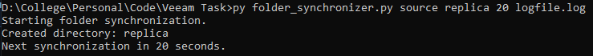
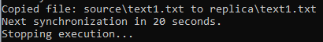
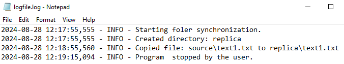

## Veeam Task - Folder Synchronization

This is a script that allow to synchronize two directories, source and replica, where the replica directory will create, change and delete files and diretories to match the source directory.

## How to use:

Using the preferred python executable such as py, python, etc followed by the script file name, folder_synchronizer.py, as arguments it takes a source and a replica directory, a time interval for the folder synchronization and a log file where all the operations made and their timestamp are saved. 

In cases when the replica directory or the logfile don't exist, those will be created during execution, only the source folder needs to be pre-existing.


The following line is a possible execution command:


```
    py folder_synchronizer.py source replica 20 logfile.log
```

This script support **-h** or **--help** command for more clarity on the positional arguments.

## Execution results:
Some information is only shown on the console because it's only for user clarity, like the time until the next synchronization. We also log into the file when we start and stop the execution of the program, making it possible to see how long the program was running for.

### Console output:




### Log file:


## Extra insights:

The output could show absolute paths throught the usage of *os.path.abspath()* when logging the operations.